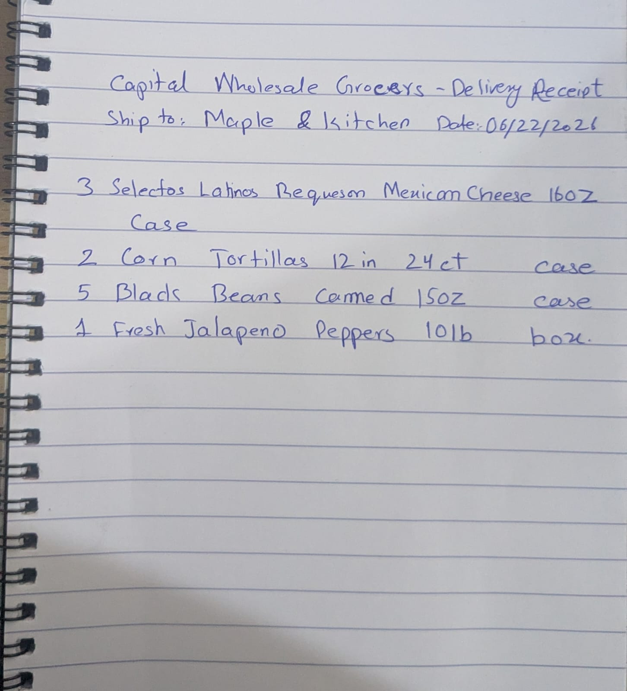

# RecallGuard


**Live demo:** https://recallguard-dashboard-306204883908.us-central1.run.app/

An autonomous agent that watches FDA and USDA food recall feeds, fuzzy-matches them
against a business's own invoices with Gemini, and drafts a pull-checklist, a
notification, and a timestamped compliance record — flagging anything ambiguous for
human review instead of guessing.

Built for the **All Things Agentic Hackathon** (Devpost). Track: **The Taskmaster**.
Also eligible for Best Architectural Design, Best Multimodal UX, and
Individual/Hobbyist.

**Scout** is the product's detective persona — a corkboard-styled dashboard and voice
layered over the same backend below (color/type tokens: Anton display type, a red
pinned-evidence-card motif, a paw-stamp "CAUGHT IT" on confirmed matches).

## Status

**Live on Google Cloud, not just locally.** Cloud Scheduler triggers a Recall Monitor
(Cloud Function) daily, which publishes genuinely new recalls to Pub/Sub; a
Matching+Action Cloud Function picks them up, reasons about them with Gemini, and
writes real results to Firestore; the dashboard (Cloud Run) reads that data and lets a
business upload invoices, review ambiguous matches, and track reconciliation — all at
the link above, right now. Everything sits inside GCP's permanent Always-Free tier by
design (Cloud Run scale-to-zero, Firestore/Pub/Sub/Scheduler under their free quotas,
Gemini via the free Developer API rather than billed Vertex AI), backed by a hard
spending cap that automatically detaches billing if that ever changes (see
[`infra/BILLING_GUARD_SETUP.md`](infra/BILLING_GUARD_SETUP.md)).

See [`docs/PHASES.md`](docs/PHASES.md) for the exact, current state of every phase.

## What's actually working

- **Recall ingestion** — live from openFDA, running on a real daily Cloud Scheduler
  job (FSIS is built but currently geo-blocked in dev; see `docs/RISK_REGISTER.md`).
- **Fuzzy matching** — Gemini reasons about messy, abbreviated real invoice text
  against a recall, returning a confidence score and a stated reason, not a black-box
  yes/no. Verified to correctly avoid false positives on same-brand/wrong-flavor
  near-misses, and to correctly escalate genuinely ambiguous cases to a human instead
  of guessing.
- **Multimodal invoices** — a photographed/scanned invoice (not just clean CSV) is read
  directly by Gemini's vision input and flows through the identical pipeline.
- **Invoices management** — upload a CSV or a photographed invoice through the live
  dashboard (not just a developer script), see a real per-invoice reconciliation
  status ("3 lines flagged," "all clear"), drill into any invoice's full per-line
  match history, search/filter, delete, and export a reconciliation CSV.
- **Action Agent** — drafts a pull-checklist, supplier + health-department notification
  drafts (labeled `DRAFT — NOT SENT`, no send-capable code exists in the module — see
  `agents/action/action_agent.py`), and a real compliance-record PDF. Resumable if PDF
  generation fails partway through — proven with a real (not mocked) failure-injection
  script, `agents/demo_failure_injection.py`.
- **Dashboard** — a live corkboard UI (FastAPI + real Firestore data, not a mockup):
  the case board, a Recall Radar, a clean streak counter, a case-file review screen
  with a working confirm/reject loop that genuinely runs the Action Agent, and the
  Invoices panel above.
- **A real, complete N=30 evaluation** — see [`docs/EXPERIMENT.md`](docs/EXPERIMENT.md):
  100% precision, 100% recall, 13.44s mean time-to-detection on the agent side, plus a
  second automated (non-LLM) comparison baseline. Human baseline is the one piece
  honestly still open — it needs a real unaided person's time, not more code.
- **103 automated tests**, all passing, across every module above — including tests
  that monkeypatch the Gemini call and assert it's invoked exactly once, so the test
  suite itself never risks burning API quota by accident.

## Real-world test, not a mocked one

A genuine handwritten invoice — real pen, real spiral-notebook paper, real lighting —
photographed and uploaded through the live dashboard exactly as a business owner would:



Gemini's vision input read it directly (no transcription, no cleanup) and matched one
line — `"3 Selectos Latinos Requeson Mexican Cheese 16oz Case"` — at **95% confidence**
against a real live recall (`H-1219-2026`, Listeria in cottage cheese), auto-actioning
it end to end: pull-checklist, supplier + health-department drafts, and a timestamped
compliance PDF, all independently re-fetched afterward from Cloud Storage and Firestore
over the live network (not just checked for a clean exit code) to confirm they're
genuinely retrievable, not just generated. See the 2026-08-29 entry in
[`docs/PROGRESS.md`](docs/PROGRESS.md) for the full verification trail.

## Architecture

Three agents mapped 1:1 to three real jobs — **sense → decide → act**: a Recall
Monitor that normalizes openFDA/FSIS data, a Matching Agent that fuzzy-matches recalls
against invoices with Gemini, and an Action Agent that drafts the compliance
artifacts. Deployed as Cloud Scheduler → Cloud Function → Pub/Sub → Cloud Function →
Firestore → Cloud Run dashboard. Full diagram and failure-path notes:
[`docs/ARCHITECTURE.md`](docs/ARCHITECTURE.md).

## Stack

Gemini via the GenAI SDK (`google-genai`) and the free Gemini Developer API —
deliberately not Vertex AI, which has no free tier · Cloud Run · Cloud Functions ·
Firestore · Pub/Sub · Cloud Scheduler · Secret Manager · FastAPI (dashboard) ·
reportlab (compliance PDFs). (Google ADK is also in the repo, powering a standalone
`agents/hello_agent/` demo — not part of the deployed pipeline, which reasons via the
GenAI SDK directly.)

## Run it locally

Needs Python 3.12+ and a free Gemini API key (no billing account, no GCP project) from
[aistudio.google.com](https://aistudio.google.com) — click "Get API key."

```bash
cd agents
pip install -r requirements.txt
cp .env.example .env        # paste your key into GOOGLE_API_KEY=
python test_gemini.py       # confirms the key works
```

**Run the full pipeline** (ingestion → matching → action → real compliance PDF, against
live recall data):

```bash
python run_matching_demo.py
```

**Run the dashboard** (reads whatever the pipeline above just produced, and lets you
upload invoices through the same UI the live deployment uses):

```bash
uvicorn dashboard.server:app --reload --port 8010
# open http://127.0.0.1:8010/
```

**Run the test suite** (offline, no API key needed — `test_image_parser.py` under
`invoices/` is the one live-network exception; run it separately and deliberately if
you want to exercise it, not via `discover`):

```bash
cd ingestion && python -m unittest discover -p "test_*.py" && cd ..
cd invoices && python -m unittest test_csv_parser test_invoice_store && cd ..
cd action && python -m unittest discover -p "test_*.py" && cd ..
cd dashboard && python -m unittest discover -p "test_*.py" && cd ..
cd experiment && python -m unittest discover -p "test_*.py" && cd ..
python -m unittest test_storage
```

**Run the N=30 evaluation** (agent side is already complete — this reproduces it):

```bash
# from agents/
python -m experiment.run_benchmark --limit 30
python -m experiment.summarize_results
python experiment/naive_baseline.py                # a second, non-LLM comparison point
python -m experiment.run_human_baseline --limit 10  # the still-open human half
```

**Try the failure-injection demo** (real, not mocked — zero Gemini cost):

```bash
python demo_failure_injection.py
```

## Live on Google Cloud

Deployed and running today — see [`docs/GCP_SETUP.md`](docs/GCP_SETUP.md) for the full
runbook and [`infra/BILLING_GUARD_SETUP.md`](infra/BILLING_GUARD_SETUP.md) for the hard
spending-cap safety net that sits underneath all of it.

## Scope

See [`docs/PLAN.md`](docs/PLAN.md) for the locked MVP scope — including what's
deliberately *not* built, and why (no real outbound sends, no chat interface, no
mobile app, no 50-state legal certification claim).

## Docs

| | |
|---|---|
| [docs/PHASES.md](docs/PHASES.md) | What's done, in progress, not started — the single source of truth for project status |
| [docs/PROGRESS.md](docs/PROGRESS.md) | Dated build log — every decision and why |
| [docs/PLAN.md](docs/PLAN.md) | Full build plan + verified hackathon rules |
| [docs/ARCHITECTURE.md](docs/ARCHITECTURE.md) | System diagram + failure paths |
| [docs/DATA_MODEL.md](docs/DATA_MODEL.md) | Firestore schema |
| [docs/AGENTS.md](docs/AGENTS.md) | Agent pseudocode |
| [docs/EXPERIMENT.md](docs/EXPERIMENT.md) | N=30 evaluation design + final results |
| [docs/RISK_REGISTER.md](docs/RISK_REGISTER.md) | Known risks + mitigations |
| [docs/GCP_SETUP.md](docs/GCP_SETUP.md) | Cloud deployment runbook |
| [infra/BILLING_GUARD_SETUP.md](infra/BILLING_GUARD_SETUP.md) | Automatic hard spending-cap setup |
| [agents/README.md](agents/README.md), [agents/dashboard/README.md](agents/dashboard/README.md), [agents/experiment/README.md](agents/experiment/README.md) | Per-component quick-starts |

## License

[MIT](LICENSE).
