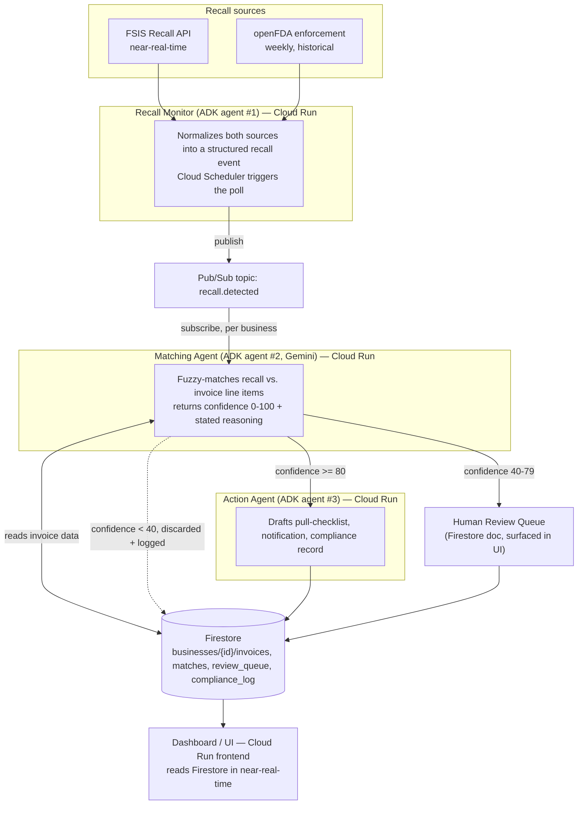

# RecallGuard — Architecture

## Why three agents, not one or six

One agent conflates "detect," "reason about a fuzzy match," and "produce a compliance
artifact" into a single prompt — harder to test, harder to explain, and it hides the
exception-handling step judges are told to look for. Three agents map 1:1 to the three real
jobs: **sense → decide → act.**

## Data direction and failure paths

- **Sense (Monitor):** pulls from two external APIs on a schedule. On API failure: retry
  with backoff, log the gap in Firestore, advance nothing — never silently skip a poll
  window.
- **Decide (Matching):** reads an event off Pub/Sub + reads invoice data from Firestore,
  writes a match record back to Firestore with its confidence and reasoning attached. Never
  writes directly to the review queue or compliance log except through its own explicit
  routing decision.
- **Act (Action):** only runs on `auto_actioned` matches. If a downstream step fails
  mid-artifact-generation (e.g. PDF export fails after the checklist succeeds), per-step
  state in Firestore means the workflow resumes from the failed step, not from scratch.
- **Human Review Queue:** the escape hatch for anything the Matching Agent isn't confident
  about — nothing pending review is ever auto-actioned.

## Google Cloud services

| Service | Role |
|---|---|
| Cloud Run | Hosts monitor, matching, action, and dashboard services; scales to zero between polls |
| Pub/Sub | Decouples detection from matching — async, retryable, fans out per business |
| Firestore | Persistent per-business state across sessions; NoSQL fits variable invoice schemas |
| Vertex AI (Gemini) | The reasoning engine for fuzzy matching + drafting |
| Cloud Scheduler | Triggers the Recall Monitor poll — the one deterministic piece; the agentic value is downstream |

## Data model and agent logic

- Firestore schema: `docs/DATA_MODEL.md`
- Full per-agent pseudocode: `docs/AGENTS.md`
